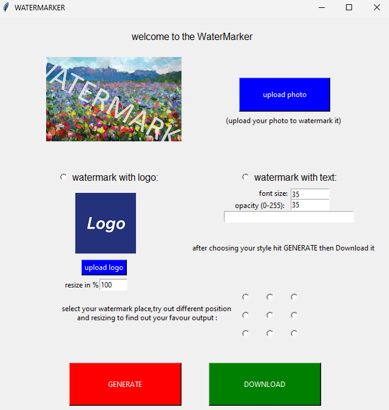

# Watermarker - Tkinter GUI

A simple image watermarking tool built with Python and Tkinter.

## Screenshot

## Features
- Add text or logo watermarks to images.
- Adjust watermark size, position, and opacity.
- User-friendly GUI for easy selection and customization.

